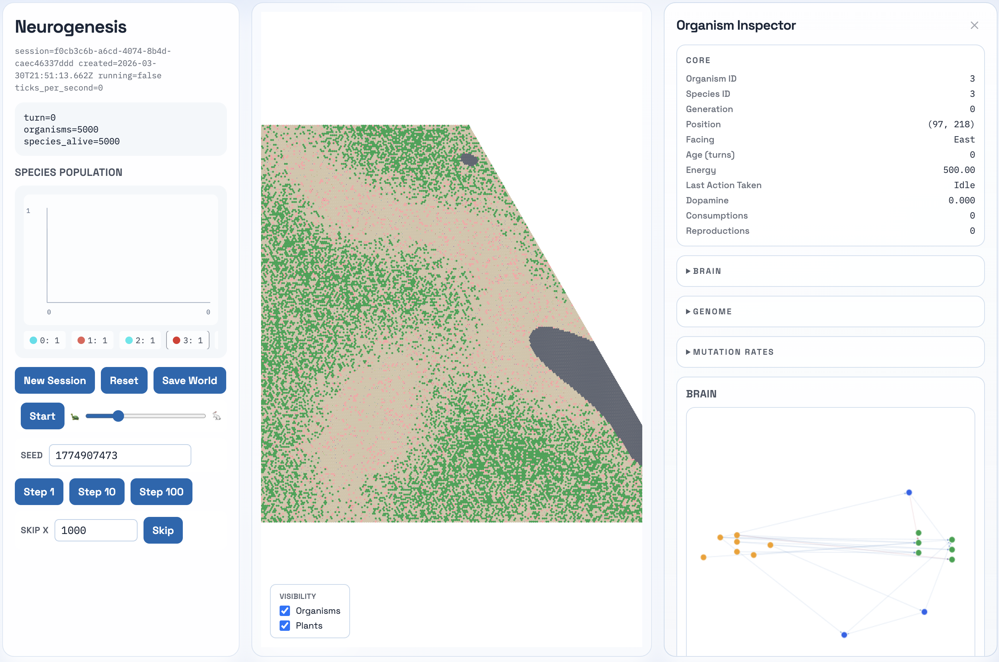
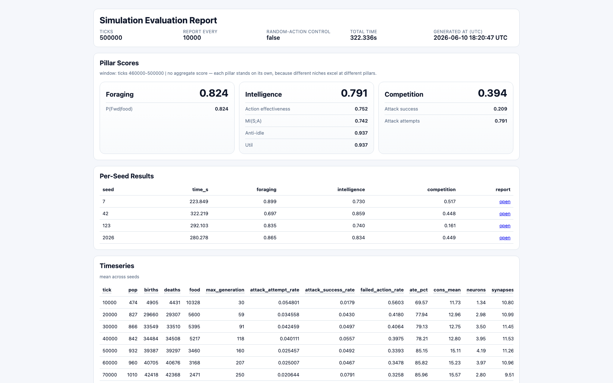

# Neurogenesis

Neurogenesis is a Rust-based neuroevolution artificial-life simulation.

Its overarching goal is to simulate the real world open-ended evolution of
cognition, from basic sensory-motor reactions in early bilaterians 600+ million
years ago to complex intelligence.

It adheres to an emergent design philosophy that combines biological realism
(i.e. modeling biological evolution along with the most simple and general
principles underlying life) with extreme computational efficiency (i.e.
massively compressing the timeline).

Inspirations:

- The starting place of bilaterian organisms/brains and a
  foraging/navigation-centric environment are directly inspired by Max Bennett’s
  book A Brief History of Intelligence, which examines the phylogenetic history
  of human intelligence starting at the very beginning of cellular life.
- The brain’s design is a mix of ideas from biological and artificial neural
  networks.
- The design of the environment and ecological dynamics is heavily inspired by
  real world evolutionary biology and ecology

The main challenge is creating an evolutionary curriculum that scales
environment complexity alongside cognitive evolution while avoiding convergence
to degenerate niches along the way.

## Quickstart

1. `cargo check --workspace`
2. `cargo test --workspace`
3. Start server: `cargo run -p sim-server`
4. In another shell: `cd web-client && npm install && npm run dev`
5. Open `http://127.0.0.1:4173`

## Evaluation Harness

Use `sim-evaluation` to benchmark the evolution loop and inspect whether
behavioral adaptation is emerging.

- Cargo command (release):
  - `cargo run -p sim-evaluation --release --`
- Make command:
  - `make evaluate`
- Baseline/random-action control:
  - `cargo run -p sim-evaluation --release -- --baseline`
- Faster smoke run:
  - `cargo run -p sim-evaluation --release -- --ticks 1000 --report-every 250`

By default the harness runs a fixed 10-seed benchmark suite. You can override it
with `--seed` and a comma-separated list such as `--seed 42,123,7`.

Each run writes artifacts under `artifacts/evaluation/...` including
`timeseries.csv`, `summary.json`, and `report.html`.

## Layout

- `sim-types/` — shared domain types used across all Rust crates.
- `sim-config/` — world/seed-genome configuration crate, TOML loader,
  validation, owned defaults/policies, and generated config reference.
- `sim-core/` — deterministic simulation engine:
  - `lib.rs` — `Simulation` struct, config validation.
  - `turn.rs` + `turn/` — tick orchestration split into lifecycle, snapshot,
    intents, move resolution, reproduction, and commit modules.
  - `brain.rs` + `brain/` — genome expression, sensing, and evaluation helpers.
  - `plasticity.rs` — runtime eligibility/coactivation and Hebbian updates.
  - `genome.rs` + `genome/` — seed generation, mutation-rate accessors, scalar
    mutation, topology mutation, spatial prior logic, and sanitization.
  - `spawn.rs` + `spawn/` — organism spawning, terrain generation, and food
    ecology/regrowth.
  - `topology.rs` — shared neuron/synapse topology helpers and invariants.
  - `grid.rs` — hex-grid geometry and occupancy helpers.
- `sim-evaluation/` — headless evaluation harness split into CLI, orchestration,
  aggregation, comparison, output, and report modules.
- `sim-server/` — Axum HTTP + WebSocket server. Server-only API types live in
  `src/protocol.rs`.
- `web-client/` — React + TailwindCSS + Vite canvas UI.
- `sim-config/config.toml` — baseline simulation configuration.
- `sim-config/CONFIG_REFERENCE.md` — generated config reference derived from the
  config source of truth.

## High level design

- Brain:
  - Each organism has a 3-layer neural circuit with sensory, inter, and action
    neurons.
  - Inter neurons are leaky integrators (`alpha` from log time constants) with
    tanh nonlinearity.
  - Synapse weights are initialized from a log-normal magnitude distribution,
    then updated by runtime plasticity and genome mutation operators.
  - Action policy is categorical sampling from softmax logits with configurable
    `action_temperature`; sampling is deterministic for fixed seed + turn +
    organism ID.
  - Runtime plasticity uses coactivation traces, dopamine from
    baseline-corrected energy delta, weight decay, and maturity-gated pruning.
- Environment:
  - Toroidal axial hex grid with static terrain walls generated from Perlin
    noise.
  - Food ecology uses a binary fertility map from Perlin noise; regrowth is
    event-driven per cell.
  - Occupancy is single-entity per cell (`Organism`, `Food`, or `Wall`).
- Algorithms:
  - Simulation advances in deterministic tick phases with stable tie-breaking.
  - Batch world runs are supported on the server and execute in parallel
    workers.
- Evolution:
  - Reproduction is asexual with per-operator mutation-rate genes and optional
    meta-mutation.
  - NEAT-style topology mutators are implemented: add synapse, remove synapse,
    and split-edge/add-neuron.
  - Spatial priors bias new synapse creation based on neuron positions.
  - The server maintains a persistent champion genome pool and bootstraps new
    sessions/batch worlds from it when available, instead of always starting
    from the primitive seed genome.
  - Periodic random injections add fresh seed-genome organisms.
- Ecology:
  - `Eat` consumes food only. Plants return `20%` of stored energy; corpses
    return `80%`.
  - `Attack` damages organisms only when split attack actions are enabled and
    spawns corpse food on lethal hits.
  - Passive metabolism scales with inter-neuron count, sensory count, synapse
    count, and vision distance.
  - Reproduction requires maturity and energy investment, then completes after a
    lock delay.

## Performance

`cargo bench -p sim-core --bench turn_throughput`

Performance regression guard tests (ignored by default):

`cargo test -p sim-core --release performance_regression -- --ignored --nocapture`

Optional CI budget override:

`SIM_CORE_TICK_BUDGET_NS_PER_TURN=130000 make perf-test`
