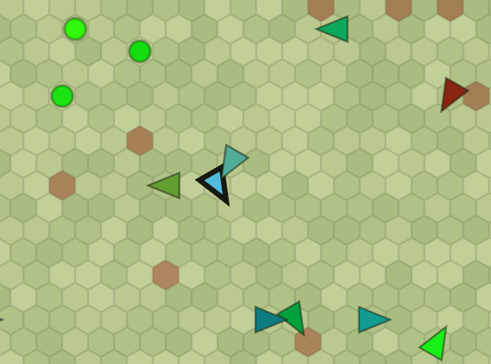
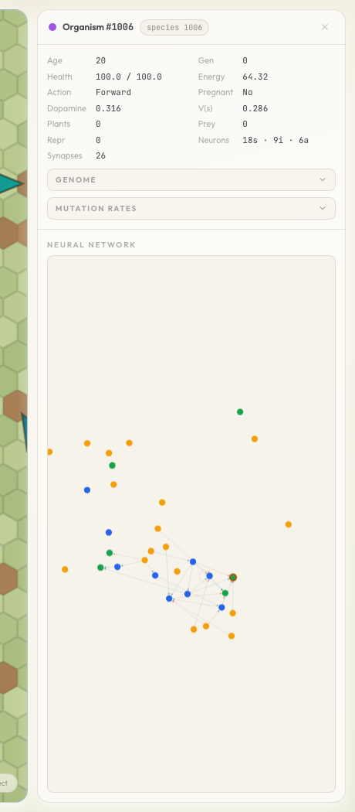
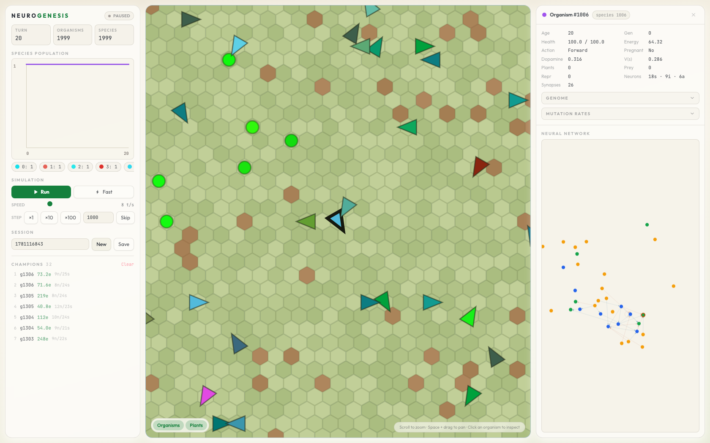

<div align="center">

# Neurogenesis

### Watch brains evolve from nothing

[](https://deepwiki.com/evanhu1/Neurogenesis)

This is a neuroevolution artificial-life simulation built in Rust. 2,000 digital
creatures spawn into a world with the simplest possible brains: **zero hidden
neurons and ten synapses.** Then ecology (energy, food, predators, and death)
and evolution (mutation and selection) "train" intelligent brains over thousands
of generations.


_In this demo run, ~1,300 generations evolved brains to **9 inter neurons and
25+ synapses**, learning to search for food, predate other organisms and run
from predators._

</div>

## How brains evolve

The seed genome has **0 inter neurons**. There is no hidden layer at the start;
sensors wire straight to actions. Over generations, NEAT-style structural
mutations add neurons and synapses, runtime plasticity tunes the weights during
each organism's lifetime, and selection decides what was worth the metabolic
cost.

|                              The world up close                              |                                      A brain, mid-life                                      |
| :--------------------------------------------------------------------------: | :-----------------------------------------------------------------------------------------: |
|  |  |

## Why

The brain is the only existence proof of general intelligence, and it was
produced by evolution. It took ~600 million years from the first neuron, but
nature had to solve problems we don't: physical embodiment, scarce energy,
generation times measured in years, and 2 billion years just to assemble the
molecular machinery of reproduction itself.

Evolution _in silico_ rewrites those constraints. Generations take seconds,
populations are observable down to the synapse, and any run can be replayed
exactly from its seed. Can a well-designed evolutionary search over brain-like
systems be a path to AGI? This project is an attempt to find out.

## Core features

**The engine**

- Deterministic and multithreaded at the same time: every random choice is a
  stateless hash of `(seed, turn, organism IDs)`, so the parallel plasticity
  pass cannot reorder history. Fixed config + seed reproduces the same world,
  tick for tick, on a given build.
- Thousands of ticks per second of whole-world simulation on a laptop (a
  30-second Fast-mode burst covered 230,000 ticks, ~7,700 t/s). The tick hot
  path is allocation-conscious Rust: parallel vectors, binary search, and
  rejection sampling instead of hash maps and scans.
- A Criterion benchmark (`turn_throughput`) tracks engine speed.

**The brain**

- Lifetime learning is **unsupervised Hebbian plasticity** — no reward, no value
  head, no dopamine. A covariance rule (Δw = η·eligibility − decay·w)
  accumulates centered pre/post coactivation into a per-synapse eligibility
  trace, decayed by an evolvable retention gene. The same rule runs everywhere:
  between inter neurons and at the motor boundary (inter→action), where the
  squashed action logit stands in as the postsynaptic activation.
- Juveniles learn at 2× the adult rate (an evolvable critical period); synapse
  pruning only activates at maturity.
- Thinking costs energy. Metabolism scales with neuron count and vision range,
  plus Kleiber mass^0.75 body scaling, so every neuron a lineage keeps has to
  pay for itself.
- The interface to the world: 18 sensory neurons in (3 vision rays × 4 channels
  of RGB + shape, plus contact, energy, health, energy flux, and
  proprioception), 6 action neurons out (turn, move, eat, attack, reproduce),
  selected by softmax sampling.

**Evolution**

- NEAT-style structural mutation: add a synapse, remove a synapse, split an edge
  into a new neuron. New synapses are drawn uniformly at random from the
  unconnected (pre, post) pairs.
- Meta-mutation: per-operator mutation rates are themselves genes.
- A persistent champion pool seeds new worlds from the best genomes of past
  sessions, and periodic injections of fresh seed genomes keep diversity
  flowing.

**The ecology**

- A 250×250 toroidal hex grid with Perlin-noise terrain walls, a hidden
  fertility map, and event-driven plant regrowth. One entity per cell.
- Energy is conserved, and lossy digestion is the ecosystem's only sink: plants
  return 20% of stored energy, corpses 80%. There is no population cap —
  thermodynamics regulates the population.
- Predation is real and every kill leaves a corpse worth eating, so death feeds
  the food web.
- No species registry, no speciation bookkeeping, no hand-written fitness
  target. Selection pressure comes from the ecology itself.

## Run it in 60 seconds

Prerequisites: Rust toolchain + Node.js.

```bash
# 1. Backend
cargo run -p sim-server

# 2. Frontend (new shell; npm install on first run)
cd web-client && npm install && npm run dev

# 3. Open http://127.0.0.1:5173 and press Run
```



Things to try:

- **Fast mode** — rendering pauses and the engine runs flat out (hundreds of
  thousands of ticks in minutes). Switch back to live view to inspect what the
  population evolved during the burst.
- **Click an organism** — live brain activity, genome, and per-operator mutation
  rates.
- **Save champions** — the server keeps a persistent champion-genome pool and
  bootstraps new worlds from it, so progress compounds across sessions.

## Measuring whether intelligence is actually emerging

`sim-evaluation` runs multi-seed, hundreds-of-thousands-of-ticks benchmarks
where the sim emits raw facts to partitioned Parquet and every metric is derived
post-hoc: foraging skill, Miller-Madow-corrected mutual information between
sensed state and action MI(S;A), competition stats, and population dynamics.
Change the analysis and re-derive every report without re-running the
experiment. A random-action control (`--baseline`) keeps the numbers honest.


```bash
# Default 8-seed evolution-loop benchmark → report.html / timeseries.csv / summary.json
cargo run -p sim-evaluation --release --

# Custom seeds
cargo run -p sim-evaluation --release -- --seed 42,123,7

# Random-action control baseline
cargo run -p sim-evaluation --release -- --baseline

# Quick smoke run
cargo run -p sim-evaluation --release -- --ticks 1000 --report-every 250

# Re-derive reports from a persisted dataset without re-running the sim
cargo run -p sim-evaluation --release -- analyze latest
cargo run -p sim-evaluation --release -- analyze 20260416T002137Z   # timestamp prefix
cargo run -p sim-evaluation --release -- analyze <path>             # run root or seed dir
```

Artifacts land under `artifacts/evaluation/...`.

## Development

```bash
cargo check --workspace   # fast compile check
cargo test --workspace    # run all tests
make fmt                  # format
make lint                 # clippy, warnings as errors
cargo bench -p sim-core --bench turn_throughput   # engine throughput benchmark
```

Workspace layout: `sim-types` (shared domain types), `sim-config` (world +
seed-genome TOML baselines), `sim-core` (the deterministic engine), `sim-server`
(Axum HTTP + WebSocket), `web-client` (React + Tailwind + Vite canvas UI),
`sim-evaluation` (headless evaluation harness).

The canonical tick order lives in `sim-core/src/turn/mod.rs::Simulation::tick`;
treat it as the source of truth for phase ordering.

Server flags:

- `--champion-pool-path <path>` — override the default `champion_pool.json` used
  for champion persistence.
- `--seed-genome-snapshot <path.bin>` — boot every organism from a single
  evaluation-snapshot genome (`.../genomes/tNNNNNN.bin`); champion saves no-op
  for the session.

Config baselines live in `sim-config/config.toml` and
`sim-config/seed_genome.toml` (the evaluation copies in `sim-evaluation/` are
kept in sync with them).
