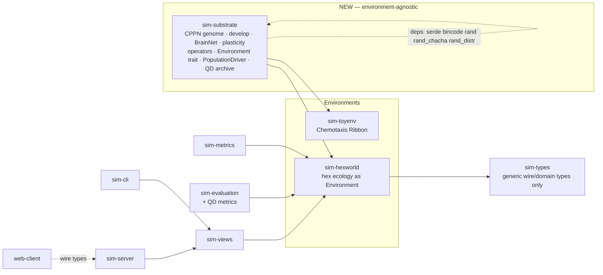
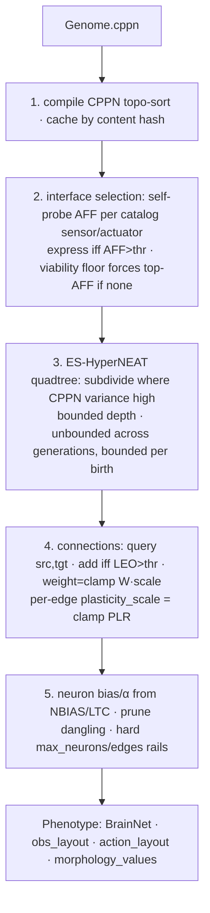
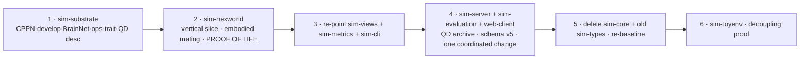

# Redesign: an environment-agnostic, indirectly-encoded evolutionary substrate

## Context

**Why.** The NeuroGenesis genome is today a **direct-encoded struct tree**
(`OrganismGenome` = one `SynapseGene` per synapse, a fixed 18-sensor / 6-action
interface, an 18/inter/6 neuron-id layout). Reproduction is **asexual
clone-and-mutate**; there is no crossover; the sensory/action interface cannot
evolve; and the brain is **hardwired to the hex world** (raycasting, RGB+Shape
vision, hex facing baked into sensing). The genome therefore has structural
_blind spots_ — whole dimensions of the phenotype (which senses/actuators exist,
how big the brain can get, how plasticity is distributed) that evolution cannot
reach.

**Goal.** A genome that fully specifies one organism **without blind spots** —
sensory/action interface, brain topology, plasticity, morphology, and mutation
rates — such that the three operators (mutation, crossover, reproduction)
incrementally complexify it, and the genome/brain/algorithm form an
**environment-agnostic meta-learner** decoupled from the embodiment and from any
one world. The hex world is the first environment; a second toy environment
validates the decoupling.

**Locked decisions** (from the user, unchanged): (1) indirect/generative CPPN
encoding that _develops_ into the phenotype (HyperNEAT lineage); (2) embodied
sexual mating as an in-world action, selection stays ecological (no fitness
function, no generations); (3) a second toy environment now, behind an
`Environment` trait; (4) clean rewrite executed strangler-fig style so the
workspace stays green at checkpoints. This plan additionally folds in a
literature review of the state of the art (below) and two user choices from it:
**hybrid adaptive-plasticity** (global rule + a per-edge CPPN learning-rate
output) and **Quality-Diversity champion tooling** adopted now.

---

## Literature review → what we adopt

The design sits squarely in a well-studied lineage. Concretely:

- **ES-HyperNEAT** (Risi & Stanley, _Artificial Life_ 2012) — the
  **adaptive-resolution quadtree** discovers _where_ hidden neurons go from
  CPPN-output variance, removing HyperNEAT's a-priori node-placement limitation.
  → This is exactly our unbounded-across-generations, bounded-per-birth
  hidden-neuron mechanism. **Adopt as the develop() core.**
- **Adaptive HyperNEAT** (Risi & Stanley, _SAB_ 2010, "Indirectly Encoding
  Neural Plasticity as a Pattern of Local Rules") — the CPPN paints **plasticity
  per connection** from geometry, not as a few global scalars. → **Adopt the
  hybrid** (user choice): keep the proven three-factor neuromodulated Hebbian
  rule as the global default, add one CPPN output `PLR` that geometrically
  scales each synapse's learning rate. Plasticity thus gets the same "no blind
  spot" treatment as weights, at small blast radius. (Full per-edge ABCD rules
  are a documented future extension.)
- **LEO / link-expression** (Verbancsics & Stanley) — decouples _whether_ an
  edge exists from its weight, the standard fix for HyperNEAT over-connectivity.
  → Already in the draft (`LEO` output). **Keep.**
- **HyperNEAT's known weakness = fracture / forced geometric regularity** (van
  den Berg & Whiteson, GECCO 2013; Clune et al.) — CPPNs struggle when
  semantically unrelated inputs sit at geometrically adjacent substrate
  coordinates. → Mitigation folded into **catalog/coordinate design** (below)
  and risks: lay out each sensor/actuator so _geometric proximity tracks
  functional similarity_, give each functional group a distinct bias-input lane,
  and seed a hand-authored CPPN. **New design constraint.**
- **Minimal Criterion Coevolution / POET** (Brant & Stanley GECCO 2017; Wang et
  al. GECCO 2019) — open-endedness from a _minimal criterion_ (survive +
  reproduce) rather than a fitness function, optionally coevolving environments.
  → Our ecological survival + embodied mating **is** minimal-criterion
  selection; the `Environment` trait is the seam a future POET-style
  env-coevolution would plug into. **Name it explicitly; no extra work now.**
- **Quality-Diversity / MAP-Elites / Novelty Search** (Mouret & Clune; Lehman &
  Stanley) — with no fitness signal, progress is measured by _behavioral
  coverage_, and champions are archived by behavior descriptor. → **Adopt now**
  (user choice): re-key the champion pool as a MAP-Elites archive over behavior
  descriptors and add QD coverage/novelty metrics to `sim-evaluation`.
- **Baldwin vs Lamarckian** (Hinton & Nowlan; Fernando et al. 2018) —
  literature: Darwinian/Baldwinian is _more stable_, Lamarckian sometimes faster
  but task-dependent. → Our **non-Lamarckian** choice (discard learned weights
  at reproduction, exactly as today's heritable `SynapseGene.weight` vs runtime
  `SynapseEdge.weight`) is the stable, well-supported default. Leave a
  documented toggle for inheriting a fraction of learned weights later.
  **Keep.**

Sources:
[ES-HyperNEAT / enhanced hypercube encoding (MIT Press ALife)](https://direct.mit.edu/artl/article/18/4/331/2720),
[Indirectly Encoding Neural Plasticity as a Pattern of Local Rules (Springer)](https://link.springer.com/chapter/10.1007/978-3-642-15193-4_50),
[Born to Learn: EPANN survey (arXiv 1703.10371)](https://arxiv.org/pdf/1703.10371),
[Critical Factors in the Performance of HyperNEAT (Oxford)](https://www.cs.ox.ac.uk/people/shimon.whiteson/pubs/vandenberggecco13.pdf),
[Minimal Criterion Coevolution (GECCO 2017)](http://www.cmap.polytechnique.fr/~nikolaus.hansen/proceedings/2017/GECCO/proceedings/proceedings_files/pap140s3-file1.pdf),
[POET (GECCO 2019)](https://dl.acm.org/doi/10.1145/3321707.3321799),
[Meta-Learning through Hebbian Plasticity in Random Networks (NeurIPS 2020)](https://proceedings.neurips.cc/paper/2020/file/ee23e7ad9b473ad072d57aaa9b2a5222-Paper.pdf),
[Evolutionary Brain-Body Co-Optimization Consistently Fails to Select for Morphological Potential (arXiv 2508.17464)](https://arxiv.org/pdf/2508.17464),
[Meta-Learning by the Baldwin Effect (arXiv 1806.07917)](https://arxiv.org/pdf/1806.07917).

---

## Target architecture

### Crate topology (additive; old code deleted only in the final phase)



- **`sim-substrate`** (new): CPPN `Genome` + header, `develop()`, `BrainNet`
  runtime + Hebbian plasticity, operators (`mutate`/`crossover`/`reproduce`),
  the `Environment` trait, the shared `PopulationDriver` that owns the tick
  loop, and the **QD behavior-descriptor + archive** types. Depends only on
  `serde`, `bincode`, `rand`, `rand_chacha`, `rand_distr` — **no
  `sim-types`/`sim-core`**.
- **`sim-hexworld`** (new, replaces `sim-core`): hex ecology as an
  `Environment`.
- **`sim-toyenv`** (new): "Chemotaxis Ribbon," reuses `sim-substrate` unchanged.
- `sim-types` keeps only generic types (see blast-radius table); `sim-config`,
  `sim-views`, `sim-metrics`, `sim-cli`, `sim-server`, `sim-evaluation`,
  `web-client` re-point at the new stack.

### Genome (indirect, in `sim-substrate`)

`Genome { cppn: CppnGenome, header: HeaderGenes }`.

- **`CppnGenome`** — NEAT-style graph: `Vec<CppnNodeGene>` (id, kind, activation
  ∈ {Tanh, Gaussian, Sin, Abs, Sigmoid, Linear, …}, bias) + `Vec<CppnConnGene>`
  (innovation, from, to, weight, enabled). **Fixed I/O signature.** Inputs: two
  substrate coordinates `x1,x2`, their delta, distance, a bias, **plus one
  bias-input lane per functional group** (the fracture mitigation — lets the
  CPPN condition on "this is a vision edge" vs "this is an interoceptive edge"
  without smuggling it through geometry). Outputs:
  - `W` — connection weight
  - `LEO` — link expression (edge exists iff `LEO > leo_threshold`)
  - `NBIAS` — neuron bias
  - `LTC` — log time constant (leaky-integrator α)
  - `AFF` — affordance expression (which sensors/actuators grow)
  - **`PLR`** — _new_: per-edge plasticity-rate scale (hybrid
    adaptive-HyperNEAT). Read once at develop; multiplies the global
    `hebb_eta_gain` on that edge.
- **`HeaderGenes`** — direct scalars for everything the CPPN does not paint: the
  plasticity **global** constants (same fields/clamps as today's
  `PlasticityGenes`: `hebb_eta_gain`, `juvenile_eta_scale`,
  `eligibility_retention`, `max_weight_delta_per_tick`,
  `synapse_prune_threshold`), lifecycle (`age_of_maturity`, `gestation_ticks`,
  `max_organism_age`), develop params (thresholds, max depth/neurons/edges), the
  **mutation-rate block**, and `morphology: Vec<f32>` of normalized scalars
  aligned to the environment's morphology schema.
- **Innovation & node identity via 64-bit structural hashing**, not a global
  counter (`hash_conn(from,to)`, `hash_node(parent_innovation)`),
  domain-separated — the key to deterministic crossover alignment under the
  engine's parallel, continuous-birth, replay-from-`(seed,turn,id)` model.
  Convergent-identical structure is treated as homologous by design.
- **Flat "bitstring" form**: `bincode::serialize(&genome)`; canonical form
  (conns innovation-sorted, nodes ordered) is bit-stable and keys the develop
  cache. (Mirrors today's `bincode::serialize_into` genome-snapshot format used
  by `sim-evaluation/src/dataset/writer.rs` and `sim-server`'s
  `--seed-genome-snapshot`.)

### develop() — ES-HyperNEAT expression (RNG-free, pure)

`develop(&Genome, &SubstrateCatalog, &DevelopConfig) -> Phenotype`



The expressed sensors/actuators define the obs-vector and action-vector slot
layouts.
`Phenotype = { brain: BrainNet, obs_layout, action_layout,
morphology_values }`.

### Brain runtime (`BrainNet`, environment-agnostic)

Pure `step(&mut self, observation: &[f32]) -> &[f32]` (obs vector → action
logits). Reuses **verbatim** the current engine's math, lifted from `sim-core`:

- Leaky-integrator inter-neurons:
  `state=(1-α)state+α·input; act=fast_tanh(state)`
  (`sim-core/src/brain/evaluation.rs:97`).
- The Padé `fast_tanh` (`sim-core/src/brain/mod.rs:39`).
- Softmax action sampler `sample_action_from_logits` with
  `EXPLICIT_IDLE_LOGIT_BIAS = -0.01` and `MIN_ACTION_TEMPERATURE = 1e-6`
  (`sim-core/src/brain/evaluation.rs:141`), exposed as an env-agnostic
  `sample_action(...)`. **The embodiment layer calls the sampler** so the
  `(seed,turn,id)` hash (`action_rng_seed`/`deterministic_action_sample`,
  `sim-core/src/turn/mod.rs:383`) stays out of the substrate.
- Within-lifetime **Hebbian-covariance plasticity** lifted from
  `sim-core/src/brain/plasticity.rs`: centered-covariance eligibility trace,
  energy-delta neuromodulator (`NEUROMOD_GAIN=0.04`, `SCALE=5.0`, band
  `[0.85,1.15]`), maturity gate, 10-tick pruning. **Hybrid change**: the
  per-tick learning term becomes
  `plasticity_scale[edge] * learning_modulator *
  eta * eligibility − decay`,
  i.e. the existing formula with a per-edge scale factor painted by the CPPN's
  `PLR`. `plasticity_scale ≡ 1.0` reproduces today's behavior byte-for-byte.
  Learned weights are **discarded at reproduction** (non-Lamarckian).

### Operators (`sim-substrate`)

- **`mutate`** — frozen, append-only gate sequence mirroring
  `sim-core/src/genome/mod.rs::mutate_genome`. Header scalar perturbations reuse
  `perturb_clamped` (additive Gaussian+clamp) and **both**
  `perturb_multiplicative_u32`/`perturb_multiplicative_f32` (log-normal). CPPN
  structural ops: perturb/replace weight, add-connection, add-node (= split
  connection), toggle-enable, mutate-activation, perturb-bias. **Meta-mutation**
  of the rate block reuses the `mutation_rates.rs` logit-space / baseline-pull
  (`META_MUTATION_BASELINE_PULL=0.15`) / zero-absorbing machinery, expanded to
  the new operators. Keep the "append new gates last, before the final
  reconcile/meta-mutate" discipline that preserves the RNG-draw prefix
  (`sim-core/src/genome/mod.rs:217-238`).
- **`crossover`** — NEAT innovation-aligned: walk both conn lists in
  innovation-sorted merge order; matching genes coin-flip/blend; disjoint/excess
  from the fitter parent (energy/age proxy at mating; ties → structural-hash
  order). Header crossed per-scalar (uniform/blend). One deterministic
  offspring.
- **`reproduce`** — sexual: `crossover(a,b) → mutate`. No asexual fallback; the
  one-sided mating path (below) covers bootstrap.

### The `Environment` boundary

The substrate owns genome/brain/operators **and** the `PopulationDriver` (the
`Vec<Body>`, RNG stream, brain eval, plasticity, energy/age/death/mating
bookkeeping, phase sequencing). The environment supplies **physics only** and
never touches genome/brain/energy internals — it reads bodies through an
immutable `BodyView` and _requests_ changes through an `EffectSink`
(energy/health deltas, deaths, births, corpses); the driver applies them in
organism-index order (promoting the existing snapshot-then-apply pattern of
`apply_social_color_mortality`, `sim-core/src/turn/commit.rs:171`, to the
architectural seam). Finalize the trait in Phase 1:

```rust
trait Environment {
    fn catalogs(&self) -> &SubstrateCatalog;
    fn derive_body_params(&self, m: &MorphologyValues) -> DerivedBodyParams; // computed ONCE
    fn observe(&self, body: &BodyView, layout: &ObsLayout, out: &mut [f32]);
    fn metabolic_cost(&self, body: &BodyView) -> f32;
    fn step_world(&mut self, pop: &BodyPop, rng: &mut Rng, sink: &mut EffectSink);
    fn decode_intents(&self, body: &BodyView, action: &[f32]) -> BodyIntents;
    fn resolve_actions(&mut self, intents: &[BodyIntents], pop: &BodyPop, sink: &mut EffectSink);
    fn mate_target(&self, body: &BodyView) -> Option<BodyHandle>;
    fn place_birth(&mut self, carrier: &BodyView, rng: &mut Rng) -> Option<SpawnSite>;
    fn place_founder(&mut self, rng: &mut Rng) -> Option<SpawnSite>;
    fn on_deaths(&mut self, dead: &[BodyView], sink: &mut EffectSink);
}
```

`SubstrateCatalog = { dim, sensors: [SensorSpec{key,arity,coord,offsets}],
actuators: [...], morphology: [MorphologyParam{key,min,max,default}] }`.

**Catalog / coordinate design (fracture mitigation).** Assign substrate
coordinates so geometric proximity tracks functional similarity: the 3×4 vision
receptors laid out on an exteroceptive plane by offset×channel; interoceptive
scalars on a _separate_ plane; each functional group tagged by its own
bias-input lane. This is what keeps the CPPN's forced geometric regularity
working _for_ us instead of against us.

### Hex world mapping (`sim-hexworld`)

- **Physics** (`step_world`/`resolve_actions`/`on_deaths`): toroidal hex grid +
  occupancy, Perlin terrain/walls, spikes, fertility map + BTreeMap food
  regrowth, plants/corpses, Kleiber metabolism
  (`BODY_MASS_METABOLIC_EXPONENT
  =0.75`, `sim-core/src/metabolism.rs`),
  predation (size-ratio deterministic hash `deterministic_predation_sample`,
  kept verbatim in a shared `determinism` util), **zero-sum** social-color
  transfer (`apply_social_color_mortality`; note: its _header doc comment is
  stale_ — the code does an antisymmetric `sin`-weighted **energy transfer**,
  not pure damage — carry the corrected understanding, not the comment).
- **Sensor catalog** (from `SensoryReceptor`, 18 receptors): 12 vision (3 ray
  offsets × 4 channels — channels are **Red/Green/Blue/Shape**, not RGB-only) +
  `ContactAhead` + interoceptive `Energy`/`Health`/`EnergyDelta`/
  `LastActionForward`/`LastActionEat`. `observe` runs the existing `scan_ray`
  raycast (which lives in **`sim-core/src/brain/sensing.rs`**, not
  `src/sensing.rs`).
- **Actuator catalog** (from `ActionType`; the enum has 7 variants — `Idle` + 6
  contingent in `ActionType::ALL`): TurnLeft, TurnRight, Forward, Eat, Attack,
  and **`Mate`** (replaces solo `Reproduce`; targets the cell ahead like
  Eat/Attack). Idle stays implicit via the idle logit bias.
- **Morphology schema**: body_color (RGB), vision_distance, age_of_maturity,
  gestation_ticks, max_organism_age. **`size` stays derived** from
  gestation_ticks via `offspring_transfer_energy` (=
  `100 + 100·gestation_ticks`) — computed once in `derive_body_params`, cached
  on the body, read by both sides so
  max-health/attack/predation/metabolism/investment can't diverge.
- **Morphology-potential caution** (Aug-2025 brain-body co-opt finding): a body
  change must not silently wreck an otherwise-good controller. The indirect
  encoding already _buffers_ this — control is geometric, so it partially
  transfers across a morphology tweak — but keep the **morphology mutation rates
  conservative** (they live in the header rate block) and verify newborns of a
  morphology-mutated parent aren't systematically non-viable in the Phase-2
  headless run.

### Embodied mating (deterministic, parallel-safe)

A **Mating phase** after Intents, feeding the existing gestation→Spawn machinery
(`ReproductionPhaseState`, `sim-core/src/turn/reproduction.rs`):

1. _Intent gather_ (parallel, organism-local): if `Mate` wins, record
   `{initiator, target_cell, confidence}` subject to local eligibility (alive,
   mature, `energy ≥ investment`, not gestating, valid target).
2. _Pairing_ (serial): sort candidates by
   `(target_cell, confidence desc,
   id asc)` — the **exact scheme already in
   `sim-core/src/turn/moves.rs:34`** — walk with a `claimed` cell-mask; each
   cell/organism used at most once per tick → order-independent.
3. _Consent_ (`require_mutual_mating` config): mutual → both pay half, lower id
   gestates; one-sided (default, bootstrap) → initiator pays full and gestates,
   partner is a passive co-parent contributing genome only.
4. _Gestation_: **snapshot both parent genomes** into the gestation record at
   trigger time (clone), so birth is independent of a parent later dying (today
   this is `parent_genome.clone()` into `SpawnRequest::Reproduction`).
5. _Birth_ (serial Spawn phase, shared `sim.rng` at the exact point
   `mutate_genome` draws today, `sim-core/src/spawn/organisms.rs`):
   `child = crossover(snapA, snapB, rng); mutate(child, rng)`; place via
   `env.place_birth` into the existing `reserved_spawn_cells`; no free cell →
   existing `BlockedBirth` event.

### QD champion archive + open-endedness metrics (adopted now)

- **Behavior descriptor** in `sim-substrate` (env-agnostic vector) + a per-env
  descriptor extractor (hex: diet plant/prey ratio, realized brain size,
  exploration/turn-rate, mate rate).
- **Champion pool → MAP-Elites archive** in `sim-server`: replace the
  generation/reproduction-ranked pool (`ChampionGenomeRecord`,
  `compare_champion_records`) with a behavior-descriptor grid keeping the elite
  per cell; bump `CHAMPION_POOL_SCHEMA_VERSION` (currently **4** → **5**) and
  the `ChampionPoolEntry`/`ChampionPoolFile` shapes.
- **QD metrics** in `sim-evaluation`: archive **coverage** and
  **novelty/QD-score** columns alongside the existing Parquet dataset, as the
  open-ended progress signal that replaces a fitness curve.

### Second environment — "Chemotaxis Ribbon" (`sim-toyenv`)

1-D toroidal ribbon, scalar drifting nutrient field. Sensors
`{GradientSign,
LocalConcentration, Energy, Crowding}`; actuators
`{MoveLeft, MoveRight, Eat,
Mate}`; morphology
`{metabolic_thrift, gut_capacity}` + reused lifecycle scalars (**no body_color,
no vision_distance**); corpses fertilize the local field. Mating uses the
identical shared protocol. Building this with only the trait is the definitive
proof of decoupling.

---

## Blast radius (condensed; verified across the workspace)

| Area                                                                                                                       | Change                                                                                                                                                                                                                                                                                                                                                                                                                                                                                                                                                                                                                          |
| -------------------------------------------------------------------------------------------------------------------------- | ------------------------------------------------------------------------------------------------------------------------------------------------------------------------------------------------------------------------------------------------------------------------------------------------------------------------------------------------------------------------------------------------------------------------------------------------------------------------------------------------------------------------------------------------------------------------------------------------------------------------------- |
| `sim-types/src/lib.rs`                                                                                                     | **Delete** direct-encoding types (`OrganismGenome`, `TopologyGenes`, `LifecycleGenes`, `PlasticityGenes`, `MutationRateGenes`, `BrainTopology`, `SynapseGene`/`SynapseEdge`, `BrainState` + neuron states, `NeuronId` layout consts `INTER_NEURON_ID_BASE=1000`/`ACTION_NEURON_ID_BASE=2000`, `ActionType`/`SensoryReceptor`/`VisionChannel` fixed enums, `ActionRecord`). CPPN + expressed-net types live in `sim-substrate`. **Keep** ids, `RgbColor`, `VisualProperties`, terrain/food/entity, `MetricsSnapshot`/`TickDelta`/`WorldSnapshot`. `OrganismState.genome/.brain` retype (they are its last two fields, L664-665). |
| `sim-config`                                                                                                               | `SeedGenomeConfig` (`num_neurons`/`num_synapses`/`vision_distance` + lifecycle/plasticity/16 mutation-rate scalars) → **seed-CPPN + header descriptor**. Rewrite `sim-config/seed_genome.toml`; keep `sim-evaluation`'s TOMLs in sync (CLAUDE.md).                                                                                                                                                                                                                                                                                                                                                                              |
| `sim-core/genome/*`, `brain/*`                                                                                             | Replaced by `sim-substrate`. `express_genome` (in **`brain/expression.rs`**) → `develop()`; `scan_ray` (in **`brain/sensing.rs`**) moves into `sim-hexworld` and feeds an obs vector.                                                                                                                                                                                                                                                                                                                                                                                                                                           |
| `sim-core/turn/reproduction.rs`, `spawn/organisms.rs`                                                                      | Asexual → embodied sexual mating (two parents, crossover+mutate).                                                                                                                                                                                                                                                                                                                                                                                                                                                                                                                                                               |
| `sim-views` (`lib.rs`, `inspect_ext.rs`, `dashboards.rs`)                                                                  | Shared read layer for **both** `sim-cli` and `sim-server`. Rework `inspect`/`brain`/`decide`/`genome`/`find`/`lineage` for the CPPN genome + expanded phenotype (neuron labels from catalogs, synapse walk over `BrainNet`, softmax constants re-sourced).                                                                                                                                                                                                                                                                                                                                                                      |
| `sim-metrics` (`schema.rs`, `ledger.rs`)                                                                                   | `ACTION_COUNT` (=`ALL.len()+1`=**7**), `SENSORY_BIN_COUNT` (=**4**, vision-only), `JOINT_LEN` (=**28**) are compile-time hex constants: make env-provided or keep hex-specialized for the slice. `ActionRecord` (instrumentation-gated, in `sim-types`) → catalog indices.                                                                                                                                                                                                                                                                                                                                                      |
| `sim-server` (`main.rs`, `protocol.rs`)                                                                                    | Champion pool → **QD archive**; bump `CHAMPION_POOL_SCHEMA_VERSION 4→5`; `--seed-genome-snapshot` bincode decode → `Genome`; `OrganismDetail` (carries the **full `OrganismState`** = brain+genome) and `ChampionPoolEntry` wire shapes change.                                                                                                                                                                                                                                                                                                                                                                                 |
| `sim-evaluation`                                                                                                           | Genome snapshot `.bin` (bincode `Genome`, `dataset/writer.rs`) changes; **add QD coverage/novelty columns**; re-baseline the regression harness.                                                                                                                                                                                                                                                                                                                                                                                                                                                                                |
| `web-client` (`types.ts`, `protocol.ts`, `rendering/brainCanvas.ts`, `InspectorPanel`, `BrainCanvas`, cockpit `GenomeTab`) | `Api*` genome/brain types + normalizers rewritten; brain viz reworked for CPPN + expressed net (note: TS `SensoryReceptor` is _already_ out of sync — only 4 of 7 variants — fix as part of this). Rust structs + TS `Api*` + normalizers change **together** (CLAUDE.md).                                                                                                                                                                                                                                                                                                                                                      |
| Tests / goldens                                                                                                            | New serialization invalidates every `world.bin`, genome `.bin`, `champion_pool.json`, golden snapshot. Human maintains tests (CLAUDE.md) — **enumerate breakages, do not rewrite**. Pre-existing failure `lethal_attack_spawns_corpse_food_without_feeding_attacker` (in `sim-core/src/tests/movement_resolution.rs`) is unrelated; carry it forward.                                                                                                                                                                                                                                                                           |

---

## Phased execution (each phase ends green where noted)



1. **`sim-substrate` in isolation** — CPPN genome + serde, `develop()`,
   `BrainNet`
   - hybrid plasticity, `mutate`/`crossover`, `Environment` trait, QD
     descriptor, driven by an in-crate mock env. Rest of workspace untouched. ✅
     `cargo
   check/test -p sim-substrate`.
2. **`sim-hexworld` headless vertical slice** — port hex ecology onto the trait,
   run the `sim-substrate` brain, wire embodied sexual mating. Old `sim-core`
   still present. ✅ `cargo check -p sim-hexworld` + a headless `main` that
   ticks a world showing births/deaths/stable population, deterministic for a
   fixed seed. **Proof-of-life milestone.**
3. **Re-point `sim-views` + `sim-metrics` (+ `sim-cli`)** at `sim-hexworld`. ✅
   `sim-cli new → run-to → state/pillars/inspect/brain/decide/genome/find` on a
   new-substrate world.
4. **`sim-server` + `sim-evaluation` + `web-client`** — QD archive, schema v5,
   Parquet QD columns, wire types; landed as one coordinated change. ✅
   `cargo
   check --workspace` + `npm run build && npm run typecheck`;
   browser-verify canvas/inspector/champions.
5. **Delete old code** — remove direct-encoding types from `sim-types`, delete
   `sim-core`. ✅ full `cargo check --workspace`, `make lint`, re-baseline
   `cargo
   run -p sim-evaluation --release`, regenerate goldens/champion pool.
6. **`sim-toyenv`** — Chemotaxis Ribbon on unchanged `sim-substrate`. ✅
   headless toy-env run; confirms the boundary carries no hex assumptions.

Strangler-fig ordering confines the non-compiling stretch to Phase 4 (the shared
`sim-views` choke point); old `sim-types`/`sim-core` stay intact through Phases
1–4 and are deleted only once `grep OrganismGenome` shows no live consumers.

---

## Top risks & mitigations

1. **Innovation-ID determinism** — domain-separated 64-bit structural hashing
   (collision-negligible; convergent-identical structure homologous by design).
   Unit-test that split/add-connection produce stable aligned ids and crossover
   aligns matching genes.
2. **HyperNEAT fracture / forced regularity** — catalog coordinate design
   (functional-similarity geometry + per-group bias lanes), LEO, and a
   hand-authored seed CPPN. Add a develop() test that a semantically-partitioned
   catalog yields a sane default interface.
3. **Per-birth `develop()` cost at ~2000 organisms** — bounded quadtree depth +
   neuron/edge budget, cached CPPN compile, amortization over a lifetime of
   `step`. Add a `bench` comparing develop throughput to today's
   `express_genome` before wiring into the turn loop.
4. **Degenerate/exploding phenotypes** — viability floor (force top-`AFF` sensor
   & actuator), dangling-neuron pruning, weight clamps, hard neuron/edge rails,
   seed CPPN.
5. **Brain-body co-optimization fails to select for morphological potential**
   (Aug-2025) — indirect-encoding control-transfer buffer + conservative
   morphology mutation rates; Phase-2 check that morphology-mutated newborns are
   viable.
6. **Porting the coupled ecology** (`size` mega-dial, zero-sum social-color) —
   compute derived body params once, read from cache; keep RNG-free functions
   verbatim; gate the port behind a golden byte-diff of preserved behaviors
   (metabolism/spikes/predation/social-color) vs current sim.
7. **Deterministic mating under parallelism** — all cross-organism decisions and
   RNG draws confined to serial phases ordered by `(cell,confidence,id)`;
   1-vs-N-thread test asserts identical child genomes and population.
8. **Serialization / golden break** — expected and accepted; `sim-evaluation` is
   the Phase-5 re-baseline tool; flag broken tests to the human, don't rewrite.

---

## Verification

- **Substrate (Phase 1)**: `cargo test -p sim-substrate` — serde round-trip,
  deterministic mutate/crossover under fixed seed, develop→step produces an
  action vector, plasticity step (with a non-unit `PLR` scale) changes weights
  deterministically, structural-hash alignment test.
- **Hex slice (Phase 2)**: headless driver a few thousand ticks — non-zero
  births/deaths, stable population, byte-identical repeat for a fixed seed;
  golden byte-diff of preserved ecology behaviors vs current `sim-core`;
  morphology-mutant viability check.
- **Tooling (Phase 3-4)**: `sim-cli` read commands on a new-substrate world;
  `sim-server` + `npm run dev` driven with `agent-browser` (canvas, inspector
  CPPN/phenotype view, brain canvas, QD-archive champion save/load);
  `npm run
  build && npm run typecheck`.
- **Regression (Phase 5)**: `cargo run -p sim-evaluation --release` re-baselined
  across seeds, now reporting QD coverage/novelty; `make lint`;
  `cargo check
  --workspace` with no old types (`grep OrganismGenome` clean).
- **Decoupling (Phase 6)**: Chemotaxis Ribbon runs on unchanged `sim-substrate`.
